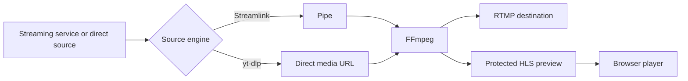

# Cricket Stream Platform

**Stable Release v1.0.0**

[Русская версия](README.ru.md)

Cricket Stream Platform is a self-hosted web application for managing live video ingestion, monitoring, and RTMP restreaming without transcoding.

The platform was created for professional live sports production, where multiple incoming streams must be monitored, controlled, and delivered to external RTMP destinations with high reliability and low latency.

Unlike a basic RTMP relay, Cricket Stream Platform combines stream management, live monitoring, diagnostics, reusable source and destination libraries, user access control, runtime metrics, and protected HLS preview in one web interface.

Production: [https://de.cricket-stream.icu](https://de.cricket-stream.icu)

> The project does not download videos or store recordings. Its primary purpose is live restreaming without transcoding.

## Key Features

- Up to 16 independent streams on one node
- YouTube, Twitch, Kick, Vimeo, and direct URL sources
- Streamlink, yt-dlp, and automatic source-engine selection
- RTMP output and protected HLS preview from the same FFmpeg process
- Video and audio stream copy without CPU-intensive transcoding
- Dashboard, complete stream list, and 1/4/9/16 monitoring layouts
- Live metrics: resolution, FPS, bitrate, processing speed, uptime, codecs, and dropped frames
- Reusable source and RTMP destination libraries
- Session history, diagnostics, and controlled automatic restart
- Viewer, Operator, and Administrator roles
- Protected preview with short-lived playback tokens
- Installed and available component version checks
- English and Russian user interface
- HTTPS through Nginx and Let's Encrypt

## Video Pipeline



FFmpeg reads the input once and produces two muxed outputs. Video and audio use stream copy for both RTMP delivery and HLS preview, so the preview does not require a separate decode or transcode process.

## Technology Stack

| Component | Technology |
|---|---|
| Backend | Python 3.13, FastAPI, Uvicorn |
| Database | PostgreSQL, SQLAlchemy, Alembic |
| Video pipeline | FFmpeg, Streamlink, yt-dlp |
| Frontend | React 19, TypeScript, Material UI, TanStack Query |
| Browser playback | HLS.js |
| Runtime updates | WebSocket |
| Reverse proxy | Nginx |
| TLS | Let's Encrypt / Certbot |
| Python environment | uv |
| Service management | systemd |

## Repository Layout

```text
cricket-stream/
├── backend/
│   ├── app/
│   │   ├── api/          REST API
│   │   ├── core/         configuration, database, authentication
│   │   ├── engine/       FFmpeg and process management
│   │   ├── models/       SQLAlchemy models
│   │   ├── providers/    Streamlink and yt-dlp
│   │   ├── services/     application services
│   │   └── websocket/    live frontend updates
│   ├── migrations/       Alembic migrations
│   └── manage.py         user and node administration
├── frontend/             React application
├── deploy/
│   ├── nginx/            reverse-proxy template
│   └── systemd/          backend service unit
├── docs/                 project documentation
└── var/hls/              temporary HLS segments, excluded from Git
```

## Roles and Access

| Capability | Viewer | Operator | Administrator |
|---|:---:|:---:|:---:|
| View status, metrics, diagnostics, and preview | ✓ | ✓ | ✓ |
| View source URL | — | ✓ | ✓ |
| View RTMP destination URL | — | ✓ | ✓ |
| Start and stop streams | — | ✓ | ✓ |
| Edit source and source engine | — | ✓ | ✓ |
| Edit RTMP destination | — | — | ✓ |
| Manage users and system settings | — | — | ✓ |

Viewer API responses do not include `source_url` or `destination_rtmp_url`. This prevents disclosure of unpublished sources and destination addresses.

## Main Interface

- **Dashboard** — live overview of selected streams
- **Monitor** — multi-stream monitoring wall with HLS playback
- **All Streams** — complete stream inventory, filters, diagnostics, and controls
- **Libraries** — reusable source and RTMP destination records
- **Stream Details** — preview, route, metrics, sessions, and logs
- **Users** — user list and password administration
- **Account** — current-user password management
- **Components** — installed versions and update availability

## Quick Production Check

```bash
curl -fsS https://de.cricket-stream.icu/api/v1/health

sudo systemctl status cricket-backend --no-pager -l
sudo systemctl status nginx --no-pager -l

cd /opt/cricket-stream/backend
.venv/bin/alembic current
.venv/bin/alembic check
```

## Documentation

English:

- [Release Notes 1.0.0](docs/en/RELEASE_NOTES_v1.0.0.md)
- Deployment, operations, architecture, and user guides will be moved into `docs/en/`

Russian:

- [README in Russian](README.ru.md)
- [Release Notes 1.0.0 in Russian](docs/ru/RELEASE_NOTES_v1.0.0.md)
- Deployment, operations, architecture, and user guides will be moved into `docs/ru/`

Project history:

- [Changelog](CHANGELOG.md)
- [История изменений](CHANGELOG.ru.md)

## Security Principles

- `.env`, JWT secrets, database passwords, deploy keys, and TLS private keys must never be committed
- The HLS directory must not be exposed through a public Nginx alias
- Preview files are served only through the authenticated API
- Database, environment, and Nginx backups are required before production updates
- Component upgrades are explicit administrative actions and should be performed during a maintenance window

## Current Status

Version **1.0.0** is the first stable release. The complete operational cycle—create, start, monitor, diagnose, stop, and recover streams—is implemented and used in production.

Planned development areas include scheduling, distributed nodes, historical analytics, high availability, alerts, and a public API.

## License

No open-source license has been selected yet. Until a license file is added, repository contents remain subject to the copyright holder's default rights.
