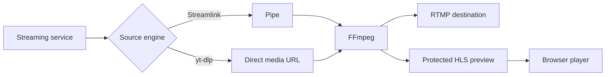

# Cricket Stream Platform

Веб-платформа для централизованного управления спортивными интернет-трансляциями.
Система забирает live-видео с YouTube, Twitch, Kick и других источников,
передаёт его на заданные RTMP-назначения и одновременно показывает защищённый
HLS-предпросмотр в браузере.

Production: [https://de.cricket-stream.icu](https://de.cricket-stream.icu)

> Проект не скачивает видеоролики и не хранит записи. Основной режим — прямая
> ретрансляция без перекодирования.

## Возможности

- до 16 независимых трансляций на одном сервере;
- источники YouTube, Twitch, Kick, Vimeo и прямые URL;
- движки `Streamlink`, `yt-dlp` и автоматический выбор;
- передача в RTMP и локальный HLS-preview одним процессом FFmpeg;
- копирование аудио и видео без CPU-тяжёлого перекодирования;
- Dashboard, список всех трансляций и многоканальный монитор 1/4/9/16;
- live-метрики: разрешение, FPS, битрейт, скорость, время работы и dropped frames;
- сохранённые библиотеки источников и RTMP-назначений;
- журнал сессий, диагностика и автоматический перезапуск;
- роли Viewer, Operator и Admin;
- защищённый preview с короткоживущими токенами;
- проверка установленных и доступных версий FFmpeg, Streamlink и yt-dlp;
- HTTPS через Nginx и Let's Encrypt.

## Видеотракт



FFmpeg получает вход один раз и создаёт два mux-выхода. Видео и аудио для обоих
выходов используют `copy`, поэтому preview не запускает отдельное декодирование
или перекодирование.

## Технологии

| Компонент | Технология |
|---|---|
| Backend | Python 3.13, FastAPI, Uvicorn |
| База данных | PostgreSQL, SQLAlchemy, Alembic |
| Видеодвижок | FFmpeg, Streamlink, yt-dlp |
| Frontend | React 19, TypeScript, MUI, TanStack Query |
| Browser video | HLS.js |
| Reverse proxy | Nginx |
| TLS | Let's Encrypt / Certbot |
| Управление Python | uv |

## Структура

```text
cricket-stream/
├── backend/
│   ├── app/
│   │   ├── api/          REST API
│   │   ├── core/         конфигурация, БД, токены
│   │   ├── engine/       FFmpeg и менеджер процессов
│   │   ├── models/       SQLAlchemy-модели
│   │   ├── providers/    Streamlink и yt-dlp
│   │   ├── services/     прикладная логика
│   │   └── websocket/    live-обновления интерфейса
│   ├── migrations/       Alembic
│   └── manage.py         пользователи и ноды
├── frontend/             React-приложение
├── deploy/
│   ├── nginx/            шаблон reverse proxy
│   └── systemd/          unit backend
├── docs/                 эксплуатационная документация
└── var/hls/              временные HLS-сегменты (не в Git)
```

## Роли и доступ

| Возможность | Viewer | Operator | Admin |
|---|:---:|:---:|:---:|
| Просмотр статуса, метрик и preview | ✓ | ✓ | ✓ |
| Просмотр URL источника | — | ✓ | ✓ |
| Просмотр RTMP-назначения | — | ✓ | ✓ |
| Запуск и остановка | — | ✓ | ✓ |
| Изменение источника | — | ✓ | ✓ |
| Изменение RTMP-назначения | — | — | ✓ |
| Управление системными настройками | — | — | ✓ |

Viewer не получает `source_url` и `destination_rtmp_url` даже в API-ответах.
Это предотвращает преждевременный просмотр непубличного источника и раскрытие
адреса публикации.

## Документация

- [Развёртывание](docs/DEPLOYMENT.md)
- [Руководство пользователя и администратора](docs/USER_GUIDE.md)
- [Эксплуатация и диагностика](docs/OPERATIONS.md)
- [Видеотракт](docs/VIDEO_PIPELINE_UPGRADE.md)
- [Дорожная карта](docs/ROADMAP.md)

## Быстрая проверка production

```bash
curl -fsS https://de.cricket-stream.icu/api/v1/health

sudo systemctl status cricket-backend --no-pager -l
sudo systemctl status nginx --no-pager -l

cd /opt/cricket-stream/backend
.venv/bin/alembic current
.venv/bin/alembic check
```

## Безопасность

- `.env`, ключи JWT, пароль БД и сертификаты не должны попадать в Git;
- HLS-каталог нельзя публиковать через открытый Nginx `alias`;
- preview выдаётся только через авторизованный API;
- перед обновлением выполняются backup БД, `.env` и Nginx;
- обновления FFmpeg, Streamlink и yt-dlp выполняются явно администратором.

## Состояние

Проект находится на стадии рабочего production MVP. Основной цикл — создание,
запуск, мониторинг, остановка и восстановление трансляций — реализован и
эксплуатируется. План дальнейшего развития находится в
[ROADMAP.md](docs/ROADMAP.md).
