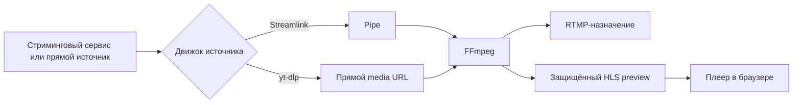

# Cricket Stream Platform

**Стабильный релиз v1.0.0**

[English version](README.md)

Cricket Stream Platform — самостоятельное веб-приложение для управления приёмом, мониторингом и RTMP-ретрансляцией прямых видеопотоков без перекодирования.

Платформа создавалась для профессионального спортивного вещания, где необходимо одновременно контролировать несколько входящих потоков и надёжно передавать их на внешние RTMP-площадки с минимальной задержкой.

В отличие от простого RTMP-ретранслятора, Cricket Stream Platform объединяет управление потоками, мониторинг, диагностику, библиотеки источников и назначений, управление доступом, онлайн-метрики и защищённый HLS-предпросмотр в одном веб-интерфейсе.

Production: [https://de.cricket-stream.icu](https://de.cricket-stream.icu)

> Проект не скачивает видеоролики и не хранит записи. Его основной режим — прямая ретрансляция без перекодирования.

## Основные возможности

- До 16 независимых трансляций на одном узле
- Источники YouTube, Twitch, Kick, Vimeo и прямые URL
- Streamlink, yt-dlp и автоматический выбор движка источника
- RTMP-выход и защищённый HLS-предпросмотр из одного процесса FFmpeg
- Копирование видео и аудио без ресурсоёмкого перекодирования
- Dashboard, полный список трансляций и мониторинг 1/4/9/16
- Онлайн-метрики: разрешение, FPS, битрейт, скорость, время работы, кодеки и dropped frames
- Библиотеки источников и RTMP-назначений
- История сессий, диагностика и контролируемый автоматический перезапуск
- Роли Viewer, Operator и Administrator
- Защищённый preview с короткоживущими токенами
- Проверка установленных и доступных версий компонентов
- Английский и русский интерфейс
- HTTPS через Nginx и Let's Encrypt

## Видеотракт



FFmpeg получает входной поток один раз и создаёт два mux-выхода. Видео и аудио для RTMP и HLS используют режим `copy`, поэтому предпросмотр не требует отдельного декодирования или перекодирования.

## Технологии

| Компонент | Технология |
|---|---|
| Backend | Python 3.13, FastAPI, Uvicorn |
| База данных | PostgreSQL, SQLAlchemy, Alembic |
| Видеотракт | FFmpeg, Streamlink, yt-dlp |
| Frontend | React 19, TypeScript, Material UI, TanStack Query |
| Воспроизведение в браузере | HLS.js |
| Обновление состояния | WebSocket |
| Reverse proxy | Nginx |
| TLS | Let's Encrypt / Certbot |
| Python-окружение | uv |
| Управление сервисами | systemd |

## Структура репозитория

```text
cricket-stream/
├── backend/
│   ├── app/
│   │   ├── api/          REST API
│   │   ├── core/         конфигурация, БД, авторизация
│   │   ├── engine/       FFmpeg и управление процессами
│   │   ├── models/       модели SQLAlchemy
│   │   ├── providers/    Streamlink и yt-dlp
│   │   ├── services/     прикладные сервисы
│   │   └── websocket/    live-обновления frontend
│   ├── migrations/       миграции Alembic
│   └── manage.py         управление пользователями и узлами
├── frontend/             React-приложение
├── deploy/
│   ├── nginx/            шаблон reverse proxy
│   └── systemd/          unit backend
├── docs/                 документация проекта
└── var/hls/              временные HLS-сегменты, не входят в Git
```

## Роли и доступ

| Возможность | Viewer | Operator | Administrator |
|---|:---:|:---:|:---:|
| Просмотр статуса, метрик, диагностики и preview | ✓ | ✓ | ✓ |
| Просмотр URL источника | — | ✓ | ✓ |
| Просмотр RTMP-назначения | — | ✓ | ✓ |
| Запуск и остановка потоков | — | ✓ | ✓ |
| Изменение источника и его движка | — | ✓ | ✓ |
| Изменение RTMP-назначения | — | — | ✓ |
| Управление пользователями и системой | — | — | ✓ |

API-ответы для Viewer не содержат `source_url` и `destination_rtmp_url`. Это защищает непубличные источники и адреса публикации.

## Основные страницы

- **Dashboard** — текущее состояние выбранных трансляций
- **Монитор** — многоканальный контроль с HLS-воспроизведением
- **Все трансляции** — полный список, фильтры, диагностика и управление
- **Библиотеки** — повторно используемые источники и RTMP-назначения
- **Подробнее** — preview, маршрут, метрики, сессии и журналы
- **Пользователи** — список пользователей и смена паролей
- **Аккаунт** — смена собственного пароля
- **Компоненты** — установленные версии и наличие обновлений

## Быстрая проверка production

```bash
curl -fsS https://de.cricket-stream.icu/api/v1/health

sudo systemctl status cricket-backend --no-pager -l
sudo systemctl status nginx --no-pager -l

cd /opt/cricket-stream/backend
.venv/bin/alembic current
.venv/bin/alembic check
```

## Документация

Русская документация:

- [Индекс документации](docs/ru/README.md)
- [Руководство пользователя](docs/ru/USER_GUIDE.md)
- [Развёртывание](docs/ru/DEPLOYMENT.md)
- [Эксплуатация](docs/ru/OPERATIONS.md)
- [Резервное копирование и восстановление](docs/ru/BACKUP_RESTORE.md)
- [Обновление](docs/ru/UPGRADE.md)
- [Архитектура](docs/ru/ARCHITECTURE.md)
- [Видеотракт](docs/ru/VIDEO_PIPELINE.md)
- [Руководство разработчика](docs/ru/DEVELOPER_GUIDE.md)
- [План развития](docs/ru/ROADMAP.md)
- [Примечания к релизу 1.0.0](docs/ru/RELEASE_NOTES_v1.0.0.md)

Английская документация:

- [English README](README.md)
- [Documentation index](docs/en/README.md)
- [User Guide](docs/en/USER_GUIDE.md)
- [Deployment Guide](docs/en/DEPLOYMENT.md)
- [Operations Guide](docs/en/OPERATIONS.md)
- [Backup and Restore](docs/en/BACKUP_RESTORE.md)
- [Upgrade Guide](docs/en/UPGRADE.md)
- [Architecture](docs/en/ARCHITECTURE.md)
- [Video Pipeline](docs/en/VIDEO_PIPELINE.md)
- [Developer Guide](docs/en/DEVELOPER_GUIDE.md)
- [Roadmap](docs/en/ROADMAP.md)
- [Release Notes 1.0.0](docs/en/RELEASE_NOTES_v1.0.0.md)

Политики и история:

- [Политика безопасности](SECURITY.ru.md)
- [Security Policy](SECURITY.md)
- [Участие в разработке](CONTRIBUTING.ru.md)
- [Contributing](CONTRIBUTING.md)
- [История изменений](CHANGELOG.ru.md)
- [Changelog](CHANGELOG.md)

## Принципы безопасности

- `.env`, JWT-секреты, пароли БД, deploy keys и закрытые TLS-ключи не должны попадать в Git
- HLS-каталог нельзя публиковать через открытый Nginx `alias`
- Preview выдаётся только через авторизованный API
- Перед production-обновлением обязательны резервные копии БД, окружения и Nginx
- Обновления компонентов выполняются администратором в плановое окно

## Текущее состояние

Версия **1.0.0** — первый стабильный релиз. Полный рабочий цикл — создание, запуск, мониторинг, диагностика, остановка и восстановление трансляций — реализован и используется в production.

В планах: планировщик, распределённые узлы, историческая аналитика, высокая отказоустойчивость, уведомления и публичный API.

## Лицензия

Открытая лицензия пока не выбрана. До появления файла лицензии содержимое репозитория регулируется стандартными авторскими правами владельца.
