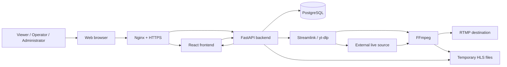
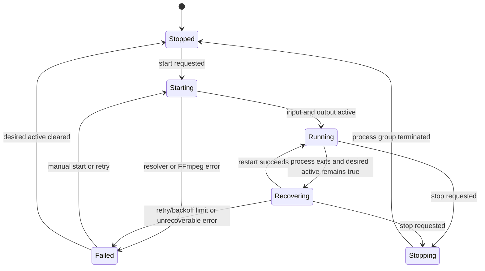
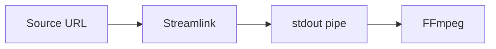
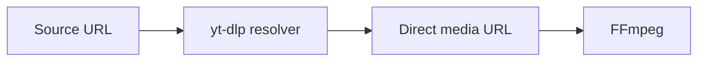

# Architecture

[Русская версия](../ru/ARCHITECTURE.md)

This document describes the architecture of Cricket Stream Platform version 1.0 and the main decisions that shape its current implementation.

## 1. Purpose

Cricket Stream Platform is a self-hosted control plane for live stream acquisition, RTMP delivery, preview, monitoring, and operational diagnostics.

The normal production path is designed around stream copy rather than transcoding:

```text
source -> resolver -> FFmpeg -> RTMP destination
                           \-> protected HLS preview
```

The platform manages processes and metadata; it is not a video-on-demand downloader or archive system.

## 2. System Context



## 3. Major Components

### 3.1 Nginx

Nginx is the public entry point.

Responsibilities:

- terminate HTTPS;
- serve the built frontend;
- proxy REST and WebSocket traffic to FastAPI;
- proxy authenticated HLS requests;
- avoid logging tokenized HLS URLs;
- redirect HTTP to HTTPS.

Nginx must not expose `/opt/cricket-stream/var/hls` through a public alias.

### 3.2 React Frontend

The frontend provides:

- authentication;
- Dashboard;
- Monitor;
- All Streams;
- stream creation, editing, and details;
- source and destination libraries;
- user and account pages;
- component-version checks;
- English and Russian localization.

Main technologies:

- React 19;
- TypeScript;
- Material UI;
- TanStack Query;
- HLS.js;
- React Router.

The frontend treats REST responses as persistent state and WebSocket messages as runtime updates.

### 3.3 FastAPI Backend

The backend provides:

- authentication and authorization;
- REST API;
- WebSocket runtime notifications;
- stream lifecycle management;
- process supervision;
- metrics and diagnostics;
- protected HLS delivery;
- session history;
- component-version checks;
- database access.

The backend process runs under `cricket-backend.service`.

### 3.4 PostgreSQL

PostgreSQL stores persistent application data, including:

- users and authorization data;
- nodes;
- streams;
- saved sources;
- saved destinations;
- stream sessions;
- configuration-related metadata.

Runtime processes and temporary HLS files are not database objects.

SQLAlchemy provides ORM mapping, and Alembic manages schema evolution.

### 3.5 Source Providers

Source providers convert a user-facing source URL into an input that FFmpeg can consume.

Current providers:

- Streamlink;
- yt-dlp;
- direct media or RTMP URL handling where applicable.

Streamlink typically writes media to stdout and FFmpeg reads from a pipe.

yt-dlp typically resolves a direct media URL that FFmpeg opens.

### 3.6 FFmpeg Engine

FFmpeg is the media-process core.

The standard process:

- opens the resolved input;
- maps the first video and audio streams when present;
- copies video and audio without transcoding;
- publishes FLV/RTMP output;
- writes temporary HLS preview;
- emits machine-readable progress;
- writes diagnostic logs.

Representative output behavior:

```text
-map 0:v:0?
-map 0:a:0?
-c:v copy
-c:a copy
```

### 3.7 Runtime Supervisor

The runtime manager owns child resolver and FFmpeg processes.

Responsibilities:

- start and stop processes;
- track PID and state;
- collect FFmpeg progress;
- update metrics;
- create session records;
- classify errors;
- implement retry and backoff;
- restore desired active streams after backend restart;
- terminate a complete process group on stop.

`KillMode=control-group` in systemd ensures child processes are stopped with the backend service.

## 4. Persistent and Runtime State

### Persistent state

Stored in PostgreSQL:

- stream configuration;
- desired active state;
- visibility settings;
- role and user information;
- libraries;
- completed and active session metadata.

### Runtime state

Kept by the backend and updated through WebSocket:

- active process state;
- PID;
- current metrics;
- most recent progress;
- current diagnostic;
- HLS readiness.

The frontend combines persistent REST data with runtime updates.

## 5. Stream Lifecycle



The exact API status names may differ from this conceptual diagram, but the lifecycle principles remain the same.

## 6. Source Resolution

### Auto mode

Auto mode selects the supported resolution path according to provider logic and fallback rules.

### Streamlink mode



Advantages:

- mature live-stream handling;
- direct segmented-stream reading;
- useful retry controls.

### yt-dlp mode



Advantages:

- alternative extractor coverage;
- useful fallback when Streamlink does not support a source-page change.

Provider websites can change independently of this project, so both engines are retained.

## 7. Dual Output Pipeline

A single FFmpeg process writes:

1. RTMP output;
2. local HLS preview.

Benefits:

- one source connection;
- consistent source and destination metrics;
- no second decoder;
- lower CPU and memory use;
- preview represents the same process that publishes RTMP.

Limitations:

- input codecs must be compatible with the destination and HLS playback;
- malformed timestamps can still require FFmpeg normalization;
- stream copy cannot repair unsupported codecs.

## 8. HLS Preview Security

Preview files are temporary and stored under:

```text
/opt/cricket-stream/var/hls/<stream-id>/
```

Security design:

- no public Nginx alias;
- authenticated API endpoints;
- short-lived playback tokens;
- tokenized URLs excluded from access logs;
- old segments deleted by FFmpeg;
- preview is operational, not archival.

## 9. Metrics

FFmpeg progress output is the primary runtime metrics source.

Metrics can include:

- output bitrate;
- source or output FPS;
- speed;
- frame count;
- dropped frames;
- output time;
- transferred bytes;
- resolution and codecs from probe or stream metadata.

Not every metric exists immediately. New streams can briefly show no data.

## 10. Diagnostics

Backend diagnostics use stable machine-readable status codes.

The frontend maps known codes to localized titles and messages. Unknown future codes fall back to backend-provided text.

This design provides:

- consistent English and Russian output;
- backward compatibility;
- safe display of new backend statuses;
- separation between operational classification and presentation language.

## 11. Authentication and Authorization

The role model has three levels.

### Viewer

- safe monitoring data only;
- source and destination URLs removed from API responses;
- no process control.

### Operator

- can view both URLs;
- can start and stop streams;
- can edit source settings;
- cannot edit RTMP destination definitions.

### Administrator

- full stream and destination control;
- library administration;
- user password administration;
- system-level pages.

Authorization is enforced by the backend. Hiding a frontend control is not considered a security boundary.

## 12. Internationalization

The frontend uses an application-level i18n context.

Design principles:

- English is the default language;
- Russian is fully supported;
- the selected language is persisted;
- language changes do not require a reload;
- translation keys are typed;
- diagnostics, errors, dates, and durations are localized;
- backend machine codes remain language-neutral.

## 13. Deployment Architecture

Production layout:

```text
Internet
   |
   v
Nginx :443
   |---- static frontend/dist
   |---- /api/ -> Uvicorn :8000
   |---- protected HLS API -> Uvicorn
                         |
                         v
                  FastAPI backend
                    |         |
                    v         v
               PostgreSQL   child processes
                            Streamlink/yt-dlp
                                   |
                                   v
                                FFmpeg
```

## 14. Failure Boundaries

### Source platform failure

Handled by diagnostics, retry, fallback engine selection, and operator action.

### RTMP destination failure

FFmpeg reports connection or authentication failure. Preview can still prove source acquisition.

### Backend restart

systemd restarts the service. Desired active streams can be restored.

### Nginx failure

Frontend and external API become unavailable, while already-running FFmpeg children can be affected if the backend service is also changed or stopped.

### PostgreSQL failure

Persistent operations fail. Existing child processes may continue temporarily, but backend supervision and recovery are not reliable until the database is restored.

### VPS failure

Requires infrastructure redundancy or a future multi-node/HA design.

## 15. Scalability

Version 1.0 operates primarily as one control plane and one execution node.

The data model includes nodes, but complete distributed orchestration is future work.

Scaling directions:

- independent worker nodes;
- node heartbeat and health;
- job placement;
- failover;
- centralized metrics;
- controlled migration between nodes.

## 16. Repository Boundaries

```text
backend/   application API, database, process engine
frontend/  browser application
deploy/    deployment templates
docs/      product, user, operations, and architecture documentation
var/       runtime data, excluded from source control
```

Production secrets and generated files are intentionally outside Git.

## 17. Architectural Principles

- reliability before optional features;
- stream copy by default;
- backend-enforced authorization;
- persistent database preservation;
- explicit migrations;
- observable process state;
- protected preview;
- small, reversible deployment changes;
- component upgrades separated from application upgrades;
- documentation in English and Russian.
