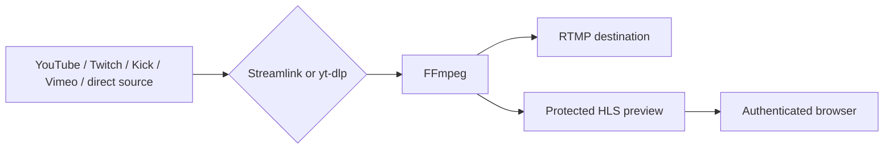

# Cricket Stream Platform 1.0.0

[Русская версия](../ru/RELEASE_NOTES_v1.0.0.md)

**Release date:** 2026-08-03  
**Release tag:** `v1.0.0`

## Overview

Version **1.0.0** is the first stable release of Cricket Stream Platform.

It provides a complete self-hosted environment for receiving live sources, forwarding them to RTMP destinations, monitoring the resulting video path, and operating multiple streams from one browser-based control panel.

The normal pipeline uses stream copy for both video and audio. This keeps CPU use low and preserves the original encoded media when the source and destination are compatible.

## Release Highlights

- Complete English and Russian interface
- Streamlink and yt-dlp source engines
- RTMP delivery and protected HLS preview
- Dashboard and 1/4/9/16 monitoring wall
- Source and RTMP destination libraries
- Live metrics, diagnostics, sessions, and logs
- Viewer, Operator, and Administrator roles
- Component version and update checks
- PostgreSQL persistence and Alembic migrations
- Production deployment through Nginx, HTTPS, and systemd

## Operational Workflow

An administrator or operator can:

1. Select or enter a source
2. Select the source engine
3. Select or enter an RTMP destination
4. Start the stream
5. Verify preview, metrics, and diagnostics
6. Monitor the stream on Dashboard or Monitor
7. Stop the stream and inspect the completed session

Desired active state can restore configured streams after a backend restart.

## Video Path



FFmpeg receives the source only once and writes both outputs without transcoding in the standard configuration.

## Roles

### Viewer

- Can view permitted status, metrics, diagnostics, sessions, and preview
- Cannot start, stop, or edit streams
- Does not receive source or destination URLs

### Operator

- Can view source and destination URLs
- Can start and stop streams
- Can edit source settings
- Cannot edit RTMP destination definitions

### Administrator

- Has all Operator capabilities
- Can manage destination definitions
- Can manage users and passwords
- Can access system administration pages

## Upgrade Notes

The production database must be preserved.

Before updating:

```bash
cd /opt/cricket-stream
git status

cp backend/.env ~/cricket-backend.env.backup

sudo -u postgres pg_dump \
  --format=custom \
  cricket_stream \
  > ~/cricket-stream-db.backup.dump

sudo cp -a \
  /etc/nginx/sites-available/cricket-stream \
  /etc/nginx/sites-available/cricket-stream.backup
```

Then update code and dependencies:

```bash
cd /opt/cricket-stream
git pull --ff-only

cd backend
uv sync --locked
.venv/bin/alembic upgrade head
.venv/bin/alembic check

cd ../frontend
npm ci
npm run build

sudo systemctl restart cricket-backend
sudo systemctl status cricket-backend --no-pager -l
```

Do not replace the production `.env` file with `.env.example`, and do not overwrite the Certbot-managed Nginx file with the repository template during a normal application update.

## Component Updates

The Components page reports installed versions and, where supported, available versions.

An available update is informational. Streamlink, yt-dlp, FFmpeg, Python, or Node.js should be upgraded only during a maintenance window followed by tests with real sources and destinations.

## Known Limitations

Version 1.0.0 does not yet provide:

- Time-based scheduling
- Automated start when a source becomes live
- Complete multi-node orchestration
- Historical analytics and traffic reports
- Recording or archive storage
- Alert delivery
- A supported public integration API

## Recommended Validation After Deployment

- Login in English and Russian
- Dashboard and monitoring layouts
- Source and destination libraries
- Stream creation and editing
- Streamlink and yt-dlp startup
- RTMP reception on the destination server
- HLS preview
- Resolution, FPS, bitrate, and uptime metrics
- Diagnostics and session logs
- User and password administration
- Component version checks

## Next Development Areas

The next major areas are expected to include scheduling, distributed nodes, analytics, high availability, alerts, and external integrations.
