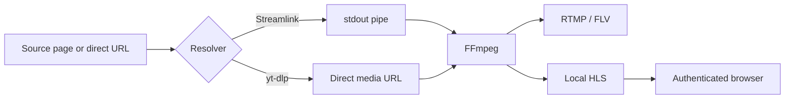

# Video Pipeline

[Русская версия](../ru/VIDEO_PIPELINE.md)

## 1. Goal

The pipeline receives a live source once, forwards it to an RTMP destination, and creates an operational HLS preview without transcoding.



## 2. Streamlink Path

Typical command behavior:

```text
streamlink --stdout SOURCE_URL best
```

FFmpeg reads `pipe:0`.

Operational options include:

- retry opening;
- segment attempts;
- segment timeout;
- stream timeout;
- HLS live edge.

Streamlink is the primary choice for supported live services.

## 3. yt-dlp Path

yt-dlp resolves a direct live media URL.

FFmpeg reads the resolved URL directly and can use reconnect options.

yt-dlp provides a practical fallback when a site change affects Streamlink extraction.

## 4. Direct Input

Direct HLS, HTTP, RTMP, or another FFmpeg-supported input can bypass page resolution.

The input is still supervised by the same runtime manager.

## 5. FFmpeg Mapping

The standard mapping is tolerant of missing audio or video:

```text
-map 0:v:0?
-map 0:a:0?
```

The question mark prevents immediate failure when one optional stream is missing.

## 6. Codec Handling

Default:

```text
-c:v copy
-c:a copy
```

No decode and encode cycle is performed.

Advantages:

- low CPU;
- low additional latency;
- original quality;
- multiple streams per VPS.

Requirements:

- source video codec must be accepted by the RTMP destination;
- audio codec must be accepted by the destination and HLS player;
- timestamps must be usable by FFmpeg.

## 7. RTMP Output

Typical output:

```text
-f flv
-flvflags no_duration_filesize
rtmp://host/application/key
```

The destination is considered successful only when the receiving server accepts the connection and media continues to flow.

A TCP port check alone is insufficient.

## 8. HLS Output

Typical behavior:

```text
-f hls
-hls_time 4
-hls_list_size 6
-hls_flags delete_segments+omit_endlist+independent_segments+program_date_time
```

Segments are stored per stream:

```text
/opt/cricket-stream/var/hls/<stream-id>/
```

The preview is intentionally short and temporary.

## 9. One FFmpeg Process

RTMP and HLS are outputs of one FFmpeg process.

This guarantees that:

- both outputs use the same input;
- metrics describe the publishing process;
- no separate preview transcode is required;
- process control is simpler.

## 10. Progress and Metrics

FFmpeg emits:

```text
-progress pipe:1
-stats_period 1
-nostats
```

The backend parses progress values and publishes runtime metrics.

Metrics can lag during startup and can be absent before the first progress block.

## 11. Timestamp and Reconnect Handling

Depending on input type, FFmpeg can use:

- generated timestamps;
- corrupt-packet discard;
- negative timestamp normalization;
- reconnect options;
- live edge selection.

These options should be changed only after testing against real sources.

## 12. Failure Classification

Typical failure groups:

- source offline;
- resolver failed;
- authentication failed;
- network unavailable;
- connection timeout;
- connection lost;
- destination refused;
- FFmpeg exited;
- no data or stalled media.

Stable backend codes are localized by the frontend.

## 13. Startup

Startup phases:

1. resolve source;
2. start FFmpeg;
3. open input;
4. connect RTMP;
5. write first progress values;
6. create HLS playlist;
7. mark preview ready.

The stream can be running before the first HLS playlist exists.

## 14. Stop and Recovery

Stop terminates the complete process group.

If desired active remains enabled and the process exits unexpectedly, the supervisor can retry with backoff.

Stop must remain available during recovery so the operator can cancel retry behavior.

## 15. Compatibility Testing

Before approving a source/destination combination, verify:

- source resolution;
- audio and video codecs;
- RTMP acceptance;
- HLS browser playback;
- FPS preservation;
- bitrate;
- GOP behavior;
- long-running stability;
- reconnect after source interruption.

## 16. When Transcoding Is Required

Transcoding should be added only for a specific compatibility requirement, such as:

- destination rejects the video codec;
- destination requires a fixed resolution;
- audio codec is unsupported;
- bitrate must be reduced;
- GOP must be normalized.

Transcoding profiles should remain optional and separate from the default stream-copy path.
