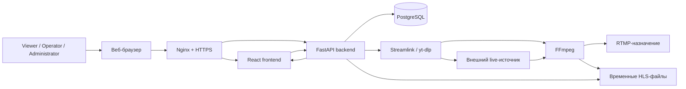
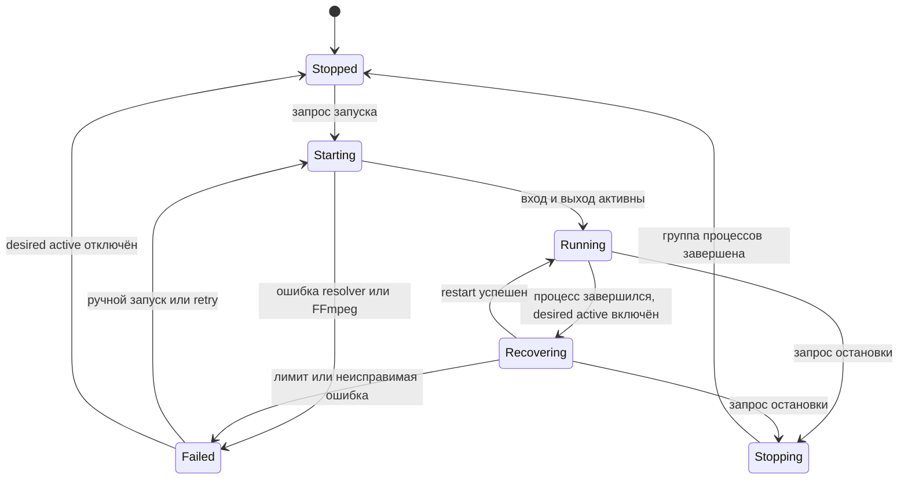
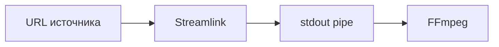

# Архитектура

[English version](../en/ARCHITECTURE.md)

Документ описывает архитектуру Cricket Stream Platform версии 1.0 и основные решения текущей реализации.

## 1. Назначение

Cricket Stream Platform — самостоятельная управляющая система для получения live-источников, передачи RTMP, preview, мониторинга и диагностики.

Штатная цепочка построена на копировании потока:

```text
источник -> resolver -> FFmpeg -> RTMP-назначение
                              \-> защищённый HLS-preview
```

Платформа управляет процессами и метаданными. Она не предназначена для скачивания VOD и архивного хранения.

## 2. Контекст системы



## 3. Основные компоненты

### 3.1 Nginx

Nginx — публичная точка входа.

Он:

- завершает HTTPS;
- раздаёт frontend;
- проксирует REST и WebSocket;
- проксирует авторизованный HLS;
- не пишет URL с playback-токенами в access log;
- перенаправляет HTTP на HTTPS.

Каталог `/opt/cricket-stream/var/hls` нельзя публиковать через открытый alias.

### 3.2 React frontend

Frontend предоставляет:

- авторизацию;
- Dashboard;
- Monitor;
- All Streams;
- создание, редактирование и подробности;
- библиотеки;
- Users и Account;
- Components;
- английскую и русскую локализацию.

Технологии:

- React 19;
- TypeScript;
- Material UI;
- TanStack Query;
- HLS.js;
- React Router.

REST используется для постоянного состояния, WebSocket — для runtime-обновлений.

### 3.3 FastAPI backend

Backend обеспечивает:

- авторизацию и права;
- REST API;
- WebSocket;
- жизненный цикл потоков;
- supervisor процессов;
- метрики и диагностику;
- защищённую выдачу HLS;
- историю сессий;
- проверку версий;
- доступ к БД.

Сервис: `cricket-backend.service`.

### 3.4 PostgreSQL

База хранит:

- пользователей;
- узлы;
- трансляции;
- источники;
- назначения;
- сессии;
- конфигурационные метаданные.

Процессы и временные HLS-файлы в БД не хранятся.

SQLAlchemy — ORM, Alembic — миграции.

### 3.5 Провайдеры источников

Провайдер преобразует пользовательский URL во вход для FFmpeg.

Используются:

- Streamlink;
- yt-dlp;
- прямые media/RTMP URL.

Streamlink обычно передаёт данные через stdout pipe.

yt-dlp обычно возвращает прямой media URL.

### 3.6 FFmpeg

FFmpeg:

- открывает вход;
- выбирает первые видео- и аудиодорожки;
- копирует их без перекодирования;
- публикует RTMP;
- создаёт HLS-preview;
- выдаёт progress;
- пишет диагностический журнал.

Типовые параметры:

```text
-map 0:v:0?
-map 0:a:0?
-c:v copy
-c:a copy
```

### 3.7 Runtime supervisor

Менеджер владеет дочерними процессами resolver и FFmpeg.

Он:

- запускает и останавливает;
- отслеживает PID;
- читает progress;
- обновляет метрики;
- создаёт сессии;
- классифицирует ошибки;
- реализует retry/backoff;
- восстанавливает desired active;
- завершает группу процессов.

`KillMode=control-group` обеспечивает остановку дочерних процессов вместе с backend.

## 4. Постоянное и runtime-состояние

### Постоянное

PostgreSQL:

- конфигурация;
- desired active;
- видимость;
- роли;
- библиотеки;
- сессии.

### Runtime

Backend и WebSocket:

- состояние процесса;
- PID;
- метрики;
- progress;
- диагностика;
- готовность HLS.

Frontend объединяет REST и runtime cache.

## 5. Жизненный цикл



Фактические имена статусов API могут отличаться, но принципы сохраняются.

## 6. Получение источника

### Auto

Выбирает подходящий путь согласно логике провайдера и fallback.

### Streamlink



### yt-dlp


Сайты источников меняются независимо от проекта, поэтому используются оба движка.

## 7. Два выхода FFmpeg

Один процесс создаёт:

1. RTMP;
2. локальный HLS-preview.

Преимущества:

- одно подключение к источнику;
- единые метрики;
- нет второго decoder;
- ниже CPU/RAM;
- preview соответствует процессу RTMP.

Ограничения:

- кодеки должны подходить принимающей стороне и HLS;
- плохие timestamps могут требовать нормализации;
- stream copy не исправляет несовместимый кодек.

## 8. Безопасность HLS

Файлы:

```text
/opt/cricket-stream/var/hls/<stream-id>/
```

Защита:

- нет публичного alias;
- API требует авторизацию;
- короткоживущие токены;
- URL с токенами не логируются;
- старые сегменты удаляются;
- preview не является архивом.

## 9. Метрики

Источник — FFmpeg progress.

Возможны:

- битрейт;
- FPS;
- speed;
- кадры;
- dropped frames;
- output time;
- байты;
- разрешение и кодеки.

Сразу после запуска часть данных может отсутствовать.

## 10. Диагностика

Backend возвращает стабильные машинные коды.

Frontend переводит известные коды. Для новых кодов используется fallback-текст backend.

Это даёт:

- единый EN/RU интерфейс;
- обратную совместимость;
- безопасное отображение новых статусов;
- отделение логики от языка.

## 11. Авторизация

### Viewer

- безопасные данные мониторинга;
- URL удалены из API;
- управления нет.

### Operator

- видит URL;
- запускает и останавливает;
- меняет источник;
- не меняет RTMP-назначения.

### Administrator

- полный доступ;
- назначения и библиотеки;
- пароли пользователей;
- административные страницы.

Безопасность обеспечивается backend, а не только скрытием кнопок.

## 12. Локализация

- английский основной;
- русский полный;
- выбор сохраняется;
- переключение без reload;
- типизированные ключи;
- локализуются ошибки, даты и длительности;
- backend-коды остаются нейтральными.

## 13. Production-схема

```text
Internet
   |
   v
Nginx :443
   |---- frontend/dist
   |---- /api/ -> Uvicorn :8000
   |---- protected HLS API
                         |
                         v
                  FastAPI backend
                    |         |
                    v         v
               PostgreSQL   Streamlink/yt-dlp
                                   |
                                   v
                                FFmpeg
```

## 14. Границы отказов

### Источник

Диагностика, retry, другой движок и действия оператора.

### RTMP

FFmpeg сообщает connect/auth ошибки. Preview может продолжать подтверждать вход.

### Backend restart

systemd запускает сервис, desired active восстанавливает потоки.

### Nginx

Frontend и внешний API недоступны.

### PostgreSQL

Постоянные операции нарушены, supervision ненадёжен до восстановления БД.

### VPS

Нужны резервная инфраструктура и будущая HA-архитектура.

## 15. Масштабирование

Версия 1.0 — в основном один control plane и один execution node.

Модель узлов уже существует, полная оркестрация планируется.

Направления:

- worker nodes;
- heartbeat;
- размещение задач;
- failover;
- централизованные метрики;
- миграция потоков.

## 16. Границы репозитория

```text
backend/   API, БД, engine
frontend/  веб-приложение
deploy/    шаблоны
docs/      документация
var/       runtime, не Git
```

Секреты и generated-файлы не входят в Git.

## 17. Принципы

- надёжность важнее дополнительных функций;
- stream copy по умолчанию;
- права проверяет backend;
- production-база сохраняется;
- миграции явные;
- процессы наблюдаемы;
- preview защищён;
- изменения небольшие и обратимые;
- обновление компонентов отдельно от приложения;
- документация EN/RU.
