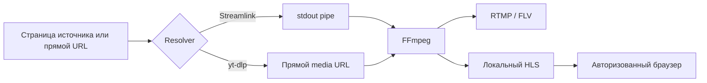

# Видеотракт

[English version](../en/VIDEO_PIPELINE.md)

## 1. Цель

Получить live-источник один раз, передать его на RTMP и создать операционный HLS-preview без перекодирования.



## 2. Streamlink

Типовая логика:

```text
streamlink --stdout SOURCE_URL best
```

FFmpeg читает `pipe:0`.

Используются retry, segment attempts, timeout и live edge.

Streamlink — основной движок для поддерживаемых live-сервисов.

## 3. yt-dlp

yt-dlp извлекает прямой media URL.

FFmpeg читает его напрямую и может использовать reconnect.

Это fallback при изменениях сайта, которые временно ломают Streamlink.

## 4. Прямой вход

Прямой HLS, HTTP, RTMP или другой вход FFmpeg не требует resolver страницы.

Он контролируется тем же runtime manager.

## 5. Mapping

```text
-map 0:v:0?
-map 0:a:0?
```

`?` позволяет работать при отсутствии одной из дорожек.

## 6. Кодеки

По умолчанию:

```text
-c:v copy
-c:a copy
```

Decode/encode не выполняется.

Преимущества:

- низкий CPU;
- малая задержка;
- исходное качество;
- больше потоков на VPS.

Требования:

- video codec принимается RTMP-сервером;
- audio codec подходит назначению и HLS;
- timestamps пригодны для FFmpeg.

## 7. RTMP

```text
-f flv
-flvflags no_duration_filesize
rtmp://host/application/key
```

Успех означает, что сервер принял соединение и media продолжает поступать.

TCP connect недостаточен.

## 8. HLS

```text
-f hls
-hls_time 4
-hls_list_size 6
-hls_flags delete_segments+omit_endlist+independent_segments+program_date_time
```

```text
/opt/cricket-stream/var/hls/<stream-id>/
```

Preview короткий и временный.

## 9. Один FFmpeg

RTMP и HLS создаёт один процесс.

Это обеспечивает:

- один вход;
- общие метрики;
- отсутствие второго transcode;
- простое управление.

## 10. Progress и метрики

```text
-progress pipe:1
-stats_period 1
-nostats
```

Backend парсит значения и обновляет runtime.

При старте метрики могут появиться с задержкой.

## 11. Timestamps и reconnect

В зависимости от входа применяются:

- generated timestamps;
- discard corrupt;
- normalization;
- reconnect;
- live edge.

Менять параметры следует только после тестов.

## 12. Ошибки

- source offline;
- resolver failed;
- authentication failed;
- network unavailable;
- connection timeout;
- connection lost;
- destination refused;
- FFmpeg exited;
- no data/stall.

Backend-коды переводятся frontend.

## 13. Запуск

1. resolver;
2. FFmpeg;
3. открытие входа;
4. подключение RTMP;
5. первые progress;
6. HLS playlist;
7. preview ready.

Процесс может работать до появления первого playlist.

## 14. Stop и recovery

Stop завершает группу процессов.

При desired active supervisor может повторять запуск с backoff.

Stop доступен во время recovery, чтобы отменить попытки.

## 15. Проверка совместимости

- resolver;
- кодеки;
- RTMP;
- HLS browser;
- FPS;
- bitrate;
- GOP;
- длительная работа;
- reconnect.

## 16. Когда нужно transcoding

Только для конкретной несовместимости:

- неподдерживаемый video codec;
- фиксированное разрешение;
- неподдерживаемое audio;
- снижение bitrate;
- нормализация GOP.

Профили должны быть отдельными и не заменять стандартный stream-copy тракт.
